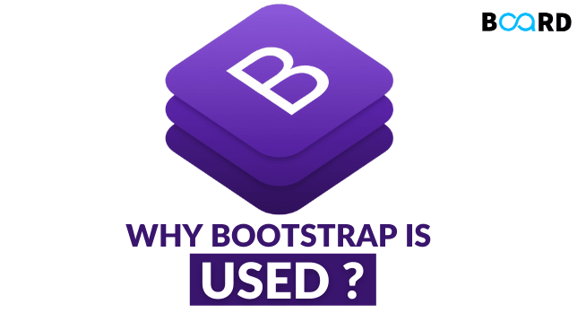

## My experience with Bootstrap 5 

Before this class I have never had any experience with HTML and CSS. At first glance, being able to see the connection between the different tags such as <div, 
, <ul>, etc, and how it creates part of a website fascinates me. I thought to myself that HTML and CSS was easy since it doesn’t really require any programming concepts, rather it just requires a basic knowledge of syntax and semantics. When it comes time to design websites like Snow Island and Murphy’s, I found myself having a really hard time figuring out what each of the tags means and what they do in general. This was an extremely frustrating experience because my mind underscores the complexity of HTML and CSS and is too lazy to learn the syntax. Using chatGPT was a huge help in completing website design. Once my first website design was complete, I felt much more confident in myself and was eager to learn more about HTML and CSS. Bootstrap 5 is introduced as a framework to reduce the need for CSS. I find Bootstrap 5 to be quite straightforward and is super time efficient because of the accessibility of pre-designed components which are great tools to make websites look amazing. 

## The power of UI Frameworks

One of the key differences between a website that is made with Bootstrap 5 and one that is not is the amount of CSS required. A website made with Bootstrap 5 utilizes pre-designed UI components such as buttons, forms, and navigation bars which results in less writing. On the contrary, primitive HTML and CSS design can achieve the same or even better design customization yet it will take more CSS writing. Personally, Bootstrap 5 has increased my efficiency in designing a website. As mentioned above, HTML and CSS has a learning curve on the syntax and semantics and being able to use Bootstrap which reduces the html and css writing is a huge bonus. For beginners, including myself, using Bootstrap 5 when design a website is a great idea because we can focus more on the creativity and uniqueness of our project rather than too much HTML and CSS. 

## Conclusion

HTML and CSS is fundamental to website design, although I am not proficient in it currently I hope to gain more knowledge and experience with HTML and CSS as it will benefit me in my software engineering career. UI frameworks such as Bootstrap 5 offer significant benefits to software engineering because it simplifies the design and development of user interfaces. While I hope to have a strong foundation in HTML and CSS, once I become more proficient, leveraging UI frameworks is really important to be consistent and save time. 

