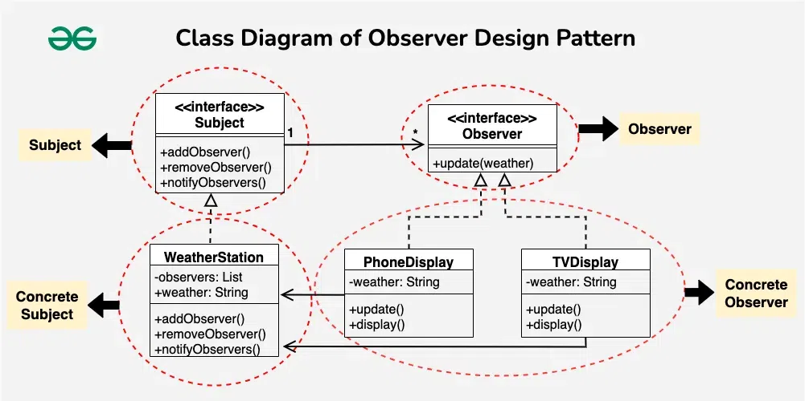

In the world of software development, there is a huge learning curve when it comes to either learning a new tech stack, a new programming language, or working with the database. In my experience, learning a new programming language, in this case Javascript, was something I have to adjust to since the only two prior programming languages I know are Java and C/C++. Learning how to work with the database can be a challenge at first since I face path issues so I had to create the database manually in PgAdmin. Through working with simple database assignments, it gave confidence to work with databases. I used to think that I don’t know Javascript, Html and CSS, and databases so I don’t know how to make a website from scratch but then this is when the design pattern and frameworks come into play.

For my ICS 314 final project, my group chose the study buddy idea which tasks us to create a website that connects student mentors/tutor with students in school that need help with homework. The design pattern that we incorporated was the Observer pattern. This design pattern is focused on event driven systems. This basically means that the object maintains a list of its dependents, called observers, and notifies them automatically of any state changes, usually by calling one of their methods.

Design patterns are not silver bullets, but they are indispensable tools in a developer's repertoire. They transform complex systems into orchestrated works of art, much like a skilled conductor brings out the best in a cacophony of musicians. As I continue my journey through software development, I’ve found that these patterns are not just theoretical constructs; they are practical, elegant solutions that resonate across projects, industries, and paradigms. 
So, what are design patterns? They are the language of collaboration in code, the architecture of software symphonies. And as for how I’ve used them? They’ve been my guiding baton, enabling me to harmonize complexity into functional beauty. 
When the interview question comes, I’ll answer it like a composer discussing their favorite symphony passionately, thoughtfully, and with the confidence of someone who’s lived the music.
