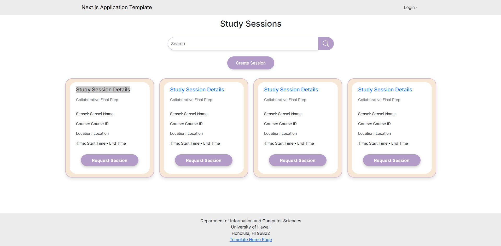

For my final project, my group created a web application called Study Buddy that connects UHM students to study. This application is tailored towards helping students preparing for finals. My contribution for this project is that I helped created the calendar system. I learned to better use Github to collaborate on a project with other teammates. I also learn to better work with the React user interface framework that allows for dynamic UI rendering. 

